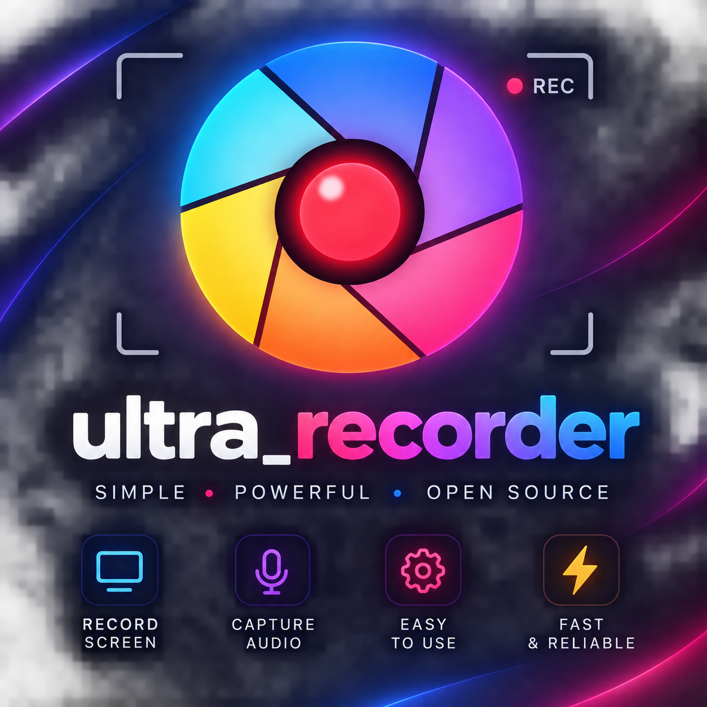
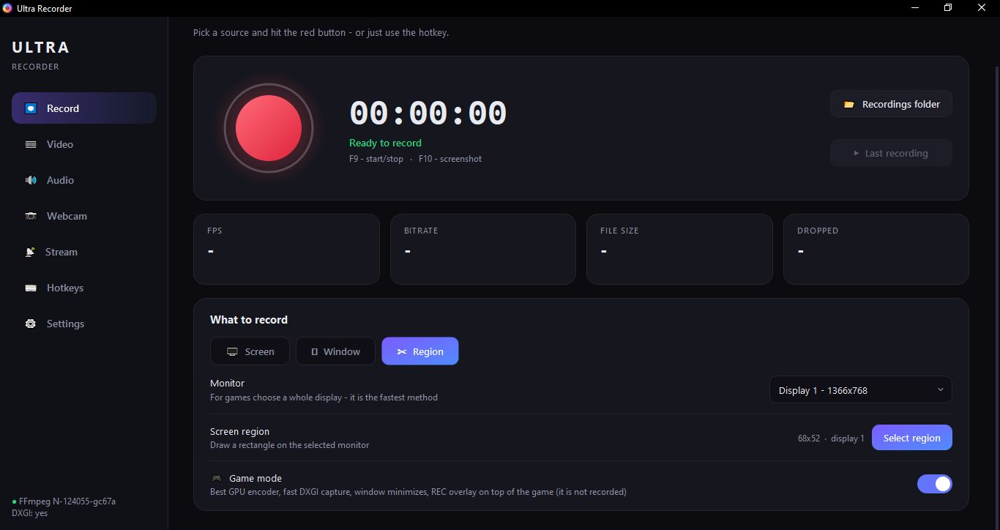
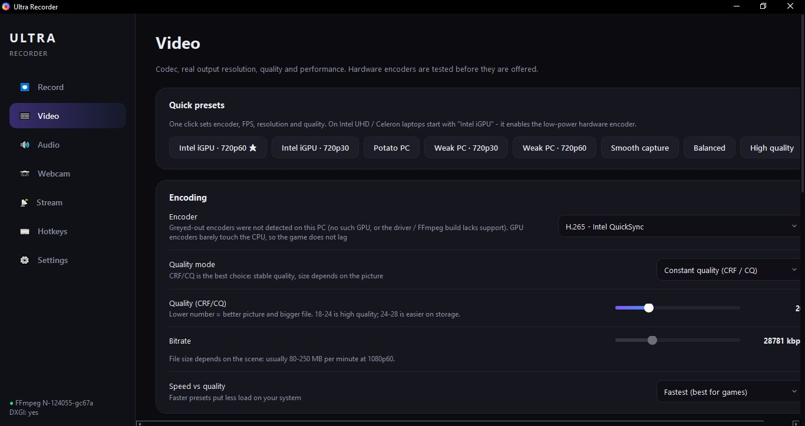
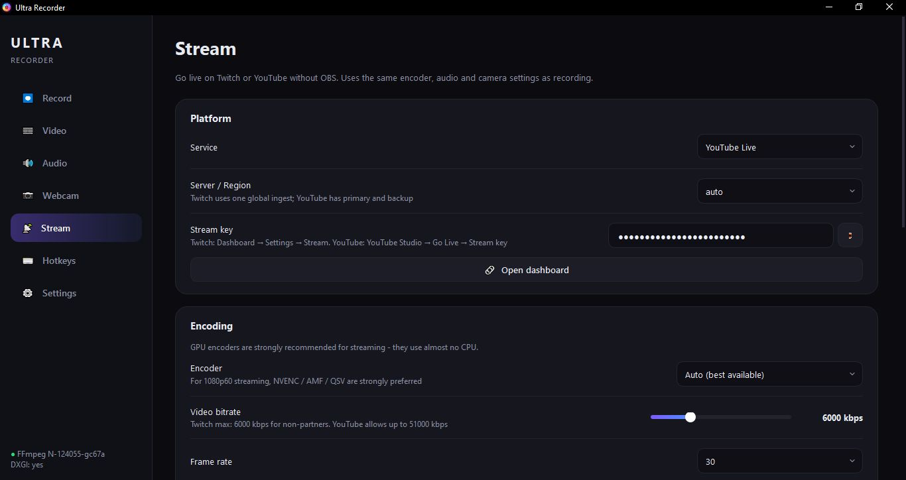
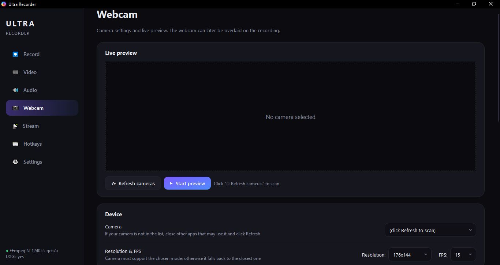

🎬 ULTRA RECORDER

⚡ ULTRA RECORDER ⚡

RECORD. STREAM. DOMINATE.

🚀 THE NEXT-GENERATION SCREEN RECORDER FOR WINDOWS

Zero lag. Zero stutter. Pure performance.

https://img.shields.io/badge/%E2%AC%87_DOWNLOAD_INSTALLER-7C5CFF?style=for-the-badge&logo=windows&logoColor=white&labelColor=0B0B10
https://img.shields.io/github/stars/your-user/ultra-recorder?style=for-the-badge&logo=github&color=4F8CFF&labelColor=0B0B10
https://img.shields.io/badge/LICENSE-MIT-2ED47A?style=for-the-badge&labelColor=0B0B10

https://img.shields.io/badge/v1.0-7C5CFF?style=flat-square&label=version&labelColor=16161E
https://img.shields.io/badge/Windows_10%2F11-4F8CFF?style=flat-square&logo=windows&logoColor=white&labelColor=16161E
https://img.shields.io/badge/Python_3.9+-2ED47A?style=flat-square&logo=python&logoColor=white&labelColor=16161E
https://img.shields.io/badge/FFmpeg_6.0+-007808?style=flat-square&logo=ffmpeg&logoColor=white&labelColor=16161E

🌟 WHY ULTRA RECORDER?

<table> <tr> <td width="50%" valign="top">
⚡ LIGHTNING FAST

DXGI Desktop Duplication straight from the GPU
Hardware encoders — NVENC / AMF / QSV
Direct GPU path — no RAM copies
Zero lag even on weak PCs

</td> <td width="50%" valign="top">
🎮 BUILT FOR GAMERS

Game Mode — one click
REC overlay on top of your game
Global hotkeys that work in-game
Auto-minimize the window

</td> </tr> <tr> <td width="50%" valign="top">
📡 STREAM WITHOUT OBS

Twitch and YouTube Live out of the box
Custom RTMP servers
Connection test before going live
H.264 CBR the way platforms love it

</td> <td width="50%" valign="top">
🎨 BEAUTIFUL UI

Dark theme with no compromises
Smooth animations everywhere
Live camera preview
Built-in screenshot editor

</td> </tr> </table>

📸 TAKE A LOOK INSIDE

⏺ RECORD TAB

One click — and you're live. Or just recording.

🎞 VIDEO SETTINGS

Presets for any hardware — from Intel Celeron to RTX 4090.

📡 STREAM

Twitch, YouTube or your own RTMP. All in one window.

📷 WEBCAM

Live preview, rotation, mirror, overlay on top of your recording.

✨ POWER IN THE DETAILS

🎥 VIDEO	🔊 AUDIO	📡 STREAM
NVENC / AMF / QSV / MF	WASAPI Loopback	Twitch + YouTube
DXGI / GDI capture	Microphone separately	Custom RTMP
Up to 240 FPS	Auto-sync	CBR for platforms
CRF / CBR / VBR	Up to 320 kbps	Connection test
Direct GPU path	No drift	H.264 CBR

📷 CAMERA	⌨ HOTKEYS	📸 SCREENSHOTS
Live preview	F9 — record	9 tools
Overlay	F8 — stream	Blur + pixelate
Shape, border	F10 — screenshot	Crop
Opacity	F11 — window	Copy to clipboard

🚀 QUICK START

<table> <tr> <td width="33%" align="center">

1️⃣

DOWNLOAD

⬇ UltraRecorder_Setup.exe

Ready-to-run installer
for Windows 10 / 11

</td> <td width="33%" align="center">

2️⃣

INSTALL FFMPEG

powershell
winget install Gyan.FFmpeg

One command —
and everything works

</td> <td width="33%" align="center">

3️⃣

PRESS F9

Recording started.
Play the game.
Forget about lag.

</td> </tr> </table>

⚡ MADE FOR WEAK PCs

Intel UHD 600? Celeron? 4 GB RAM?

Ultra Recorder was built EXACTLY for you.

text
┌─────────────────────────────────────────────────────────────┐
│                                                             │
│   🎮  GAME    →    🖥  CAPTURE   →    ⚡  QSV VDEnc         │
│                                                             │
│               60 FPS · 720p · zero lag                      │
│                                                             │
│   The hardware encoder runs on a dedicated GPU block.      │
│   The game uses shaders. The encoder — its own block.      │
│   They don't compete.                                      │
│                                                             │
└─────────────────────────────────────────────────────────────┘

One-click presets:

🥔 Potato PC — MPEG-4, 24 FPS, 720p
💻 Intel iGPU — QSV low-power, 60 FPS, 720p
⚖️ Balanced — universal preset
🔥 High quality — for powerful PCs

🎯 COMPARISON

ULTRA RECORDER	OBS	Bandicam	Fraps
Installer size	~150 MB	~350 MB	~50 MB	~5 MB
DXGI capture	✅	✅	✅	❌
Direct GPU path	✅	⚠️	⚠️	❌
QSV VDEnc	✅	❌	❌	❌
Twitch streaming	✅	✅	⚠️	❌
Screenshot editor	✅	❌	⚠️	❌
Game overlay	✅	✅	✅	✅
Global hotkeys	✅	✅	✅	✅
Open source	✅	✅	❌	❌
Setup difficulty	🟢 Easy	🔴 Hard	🟡 Medium	🟢 Easy

🧩 TECHNOLOGIES

     

Built with love from:

PyQt6 · FFmpeg · PyAudioWPatch · OpenCV · NumPy · Nuitka

📥 INSTALL FROM SOURCE

bash
# Clone
git clone https://github.com/your-user/ultra-recorder.git
cd ultra-recorder

# Install dependencies
pip install PyQt6 PyAudioWPatch numpy opencv-python

# Run
python "Ultra Recorder.py"

🔨 OR BUILD THE EXE YOURSELF

bash
pip install nuitka zstandard

python -m nuitka ^
  --standalone ^
  --enable-plugin=pyqt6 ^
  --include-qt-plugins=multimedia ^
  --windows-console-mode=disable ^
  --windows-icon-from-ico=logo.ico ^
  --output-dir=dist ^
  --remove-output ^
  "Ultra Recorder.py"

❓ FREQUENTLY ASKED QUESTIONS

 
<h3>🎬 <b>Recording is sped up or slowed down</b></h3>

Enable Force constant frame rate in Settings. This option recalculates PTS by wall-clock time and removes drift.

 
<h3>🔇 <b>No audio in the recording</b></h3>

Install PyAudioWPatch: pip install PyAudioWPatch

Make sure the selected output device is the one you actually listen on

Restart the app

 
<h3>🐌 <b>The game lags while recording</b></h3>

Enable Game Mode

Lower FPS to 30 and resolution to 720p

Enable Low-power hardware encoder (QSV) for Intel

Disable Direct GPU path (sometimes the driver can't handle it)

 
<h3>📦 <b>FFmpeg not found</b></h3>

Install via winget install Gyan.FFmpeg and restart the app. The app reads a fresh PATH from the registry — no Windows reboot needed.

 
<h3>📡 <b>Stream won't start</b></h3>

Click Test connection on the Stream tab. If it fails, check:

The stream key is fully copied

The bitrate doesn't exceed platform limits (Twitch: 6000 kbps for non-partners)

Antivirus isn't blocking outgoing RTMP

 
<h3>🎞 <b>Video is in MKV — how do I open it in an editor?</b></h3>

Remux to MP4 without re-encoding:

bash
ffmpeg -i rec.mkv -c copy rec.mp4

🤝 CONTRIBUTING

Pull requests are welcome!

For major changes, please open an issue first to discuss.

🍴 Fork the repository

🌿 Create a branch (git checkout -b feature/amazing)

💾 Commit (git commit -m 'Add amazing feature')

🚀 Push (git push origin feature/amazing)

🎉 Open a Pull Request

📄 LICENSE

MIT License

Use it freely, including in commercial projects.

https://img.shields.io/badge/MIT-2ED47A?style=for-the-badge&labelColor=0B0B10

🙏 ACKNOWLEDGEMENTS

<table> <tr> <td align="center" width="25%">
🎥 FFmpeg
ffmpeg.org

For the power

</td> <td align="center" width="25%">
🎨 PyQt6
riverbankcomputing.com

For the UI

</td> <td align="center" width="25%">
🔊 PyAudioWPatch
github

For WASAPI loopback

</td> <td align="center" width="25%">
👥 The Community

For testing
and feedback

</td> </tr> </table>

💜

MADE WITH LOVE

For everyone tired of lag while recording

https://img.shields.io/badge/%E2%AC%86_BACK_TO_TOP-7C5CFF?style=for-the-badge&labelColor=0B0B10

© 2026 Ultra Recorder

